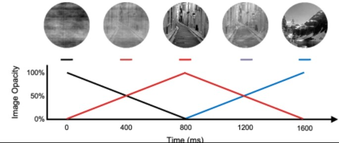

# How to Add Photos to Your Website

This guide explains exactly where and how to add photos to each section of your website.

## 📁 Recommended Folder Structure

First, create an `images` folder in your project root:

```
Personal Website/
├── index.html
├── styles.css
├── script.js
└── images/
    ├── hero-background.jpg
    ├── project1.jpg
    ├── project2.jpg
    ├── project3.jpg
    └── profile.jpg
```

---

## 1. 🏠 Home/Hero Section - Background Image

**File:** `styles.css`  
**Line:** ~293

**Current code:**
```css
.hero {
    background-image: url('your-image.jpg');
}
```

**How to change:**
1. Add your background image to the `images` folder
2. Update the path in `styles.css`:
   ```css
   background-image: url('images/hero-background.jpg');
   ```

**Image recommendations:**
- Size: 1920px × 1080px or larger
- Format: JPG, PNG, or WebP
- The image will cover the entire hero section

**Optional: Adjust overlay darkness** (line ~309):
```css
.hero::before {
    background: rgba(0, 0, 0, 0.4); /* Change 0.4 to adjust (0-1) */
}
```
- Lower value (0.2) = lighter overlay
- Higher value (0.6) = darker overlay

---

## 2. 👤 About Section - Profile Photo (Optional)

**File:** `index.html`  
**Location:** Inside `<div class="about-content">` (around line 91)

**How to add:**
1. Add your profile photo to the `images` folder
2. In `index.html`, add this BEFORE the `<div class="about-text">`:

```html
<div class="about-content">
    <div class="about-image">
        
    </div>
    <div class="about-text">
        <!-- existing text content -->
    </div>
    <!-- rest of content -->
</div>
```

**Image recommendations:**
- Size: 400px × 400px or larger (square works best)
- Format: JPG or PNG
- The image will be automatically styled and responsive

---

## 3. 💼 Work Section - Project Images

**File:** `index.html`  
**Locations:** 
- Lines 139-142 (First project)
- Lines 156-159 (Second project)
- Lines 172-175 (Third project)

**Current code (placeholder):**
```html
<div class="work-image">
    <div class="work-placeholder">
        <span>Project Image</span>
    </div>
</div>
```

**Replace with:**
```html
<div class="work-image">
    
</div>
```

**For each project:**
1. Add your project images to the `images` folder
2. Replace the placeholder div with an `` tag
3. Update the `src` path and `alt` text

**Example for all three projects:**
```html
<!-- First Project -->
<div class="work-image">
    
</div>

<!-- Second Project -->
<div class="work-image">
    
</div>

<!-- Third Project -->
<div class="work-image">
    
</div>
```

**Image recommendations:**
- Size: 800px × 500px or larger (landscape orientation)
- Format: JPG, PNG, or WebP
- Images will automatically scale and have a hover zoom effect

---

## 4. 📧 Contact Section

The contact section uses SVG icons. If you want to replace them with custom images:

**File:** `index.html`  
**Lines:** 200-215

**Current code (SVG icon):**
```html
<a href="mailto:your.email@example.com" class="social-icon" aria-label="Email">
    <svg width="24" height="24" viewBox="0 0 24 24" fill="none" stroke="currentColor" stroke-width="2">
        <!-- SVG paths -->
    </svg>
</a>
```

**Replace with image:**
```html
<a href="mailto:your.email@example.com" class="social-icon" aria-label="Email">
    
</a>
```

---

## ✅ Quick Checklist

- [ ] Created `images` folder in project root
- [ ] Added hero background image and updated `styles.css` line 293
- [ ] Added project images and replaced placeholders in `index.html`
- [ ] (Optional) Added profile photo to About section
- [ ] All image paths are correct (check for typos)
- [ ] Images are optimized (compressed for web)

---

## 🎨 Image Optimization Tips

1. **Compress images** before uploading:
   - Use tools like TinyPNG, Squoosh, or ImageOptim
   - Aim for file sizes under 500KB for faster loading

2. **Use appropriate formats:**
   - JPG for photos
   - PNG for graphics with transparency
   - WebP for modern browsers (best compression)

3. **Naming conventions:**
   - Use lowercase letters
   - Use hyphens instead of spaces: `project-1.jpg` not `Project 1.jpg`
   - Be descriptive: `hero-background.jpg` not `img1.jpg`

---

## 🐛 Troubleshooting

**Image not showing?**
- Check the file path is correct (case-sensitive on some servers)
- Make sure the image file exists in the specified location
- Check browser console for 404 errors

**Image looks stretched?**
- The CSS uses `object-fit: cover` which crops images to fit
- Use images with the recommended aspect ratios

**Image too large/small?**
- Adjust the CSS in `styles.css`:
  - `.work-image` height (line ~611)
  - `.about-image` max-width (in styles.css)

---

## 📝 Summary

- **Hero background:** `styles.css` line 293
- **Project images:** `index.html` lines 139-142, 156-159, 172-175
- **Profile photo:** `index.html` line 91 (optional)
- **Contact icons:** `index.html` lines 200-215 (optional)

All image styling is already set up in `styles.css` - just add your images and update the paths!

